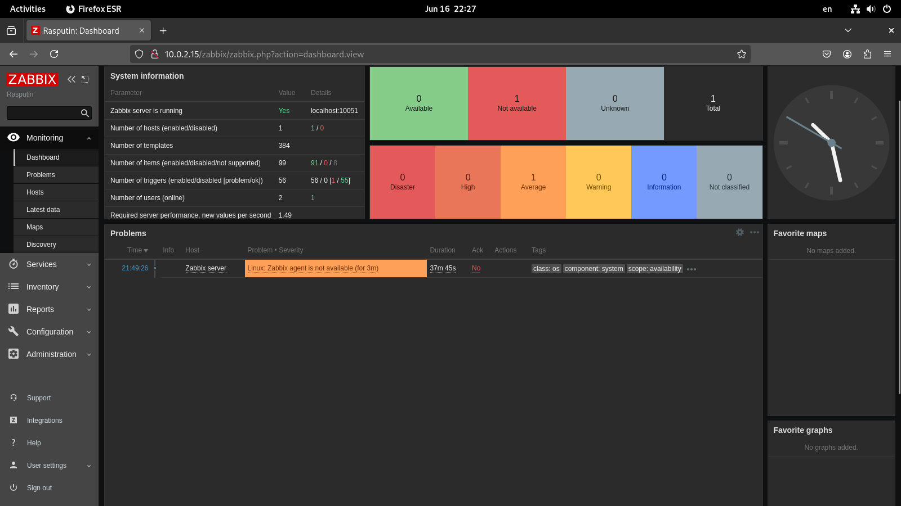
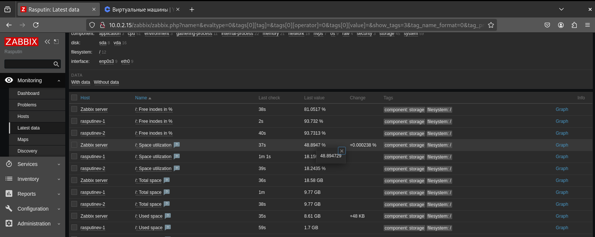

# Домашнее задание к занятию "`Система мониторинга Zabbix`" - `Распутин Е.В.`

---

### Задание 1

`Установите Zabbix Server с веб-интерфейсом.`
`Процесс выполнения`

1. `Выполняя ДЗ, сверяйтесь с процессом отражённым в записи лекции.`
2. `Установите PostgreSQL. Для установки достаточна та версия, что есть в системном репозитороии Debian 11.`
3. `Пользуясь конфигуратором команд с официального сайта, составьте набор команд для установки последней версии Zabbix с поддержкой PostgreSQL и Apache.`
4. `Выполните все необходимые команды для установки Zabbix Server и Zabbix Web Server.`

`Требования к результатам`

   `Прикрепите в файл README.md скриншот авторизации в админке.`
   `Приложите в файл README.md текст использованных команд в GitHub.`

### Решение к заданию 1

`Прикрепите в файл README.md скриншот авторизации в админке.`


`Используемые команды`
```
apt update
apt install postgresql
wget https://repo.zabbix.com/zabbix/6.0/debian/pool/main/z/zabbix-release/zabbix-release_latest_6.0+debian12_all.deb
dpkg -i zabbix-release_latest_6.0+debian12_all.deb
apt update 
apt install zabbix-server-pgsql zabbix-frontend-php php8.2-pgsql zabbix-apache-conf zabbix-sql-scripts
su - postgres -c 'psql --command "CREATE USER zabbix WITH PASSWORD '\'1423'';"'
su - postgres -c 'psql --command "CREATE DATABASE zabbix OWNER zabbix;"'
zcat /usr/share/zabbix-sql-scripts/postgresql/server.sql.gz | sudo -u zabbix psql zabbix 
sed -i 's/# DBPassword=/DBPassword=1423/g' /etc/zabbix/zabbix_server.conf
systemctl restart zabbix-server apache2
systemctl enable zabbix-server apache2
```

---

### Задание 2

`Установите Zabbix Agent на два хоста.`

`Процесс выполнения`

1. `Выполняя ДЗ, сверяйтесь с процессом отражённым в записи лекции.`
2. `Установите Zabbix Agent на 2 вирт.машины, одной из них может быть ваш Zabbix Server.`
3. `Добавьте Zabbix Server в список разрешенных серверов ваших Zabbix Agentов.`
4. `Добавьте Zabbix Agentов в раздел Configuration > Hosts вашего Zabbix Servera.`
5. `Проверьте, что в разделе Latest Data начали появляться данные с добавленных агентов.`

`Требования к результатам`

1. `Приложите в файл README.md скриншот раздела Configuration > Hosts, где видно, что агенты подключены к серверу`
2. `Приложите в файл README.md скриншот лога zabbix agent, где видно, что он работает с сервером`
3. `Приложите в файл README.md скриншот раздела Monitoring > Latest data для обоих хостов, где видны поступающие от агентов данные.`
4. `Приложите в файл README.md текст использованных команд в GitHub`

### Решение к заданию 2

`Установите Zabbix Agent на 2 вирт.машины, одной из них может быть ваш Zabbix Server.`


`Приложите в файл README.md скриншот раздела Configuration > Hosts, где видно, что агенты подключены к серверу`


`Приложите в файл README.md скриншот лога zabbix agent, где видно, что он работает с сервером`


`Приложите в файл README.md скриншот раздела Monitoring > Latest data для обоих хостов, где видны поступающие от агентов данные.`


`Приложите в файл README.md текст использованных команд в GitHub`
```
su -
apt update
wget https://repo.zabbix.com/zabbix/6.0/debian/pool/main/z/zabbix-release/zabbix-release_latest_6.0+debian11_all.deb
dpkg -i zabbix-release_latest_6.0+debian11_all.deb
apt update 
apt install zabbix-agent
'отредактировать строку Server=127.0.0.1 в файле /etc/zabbix/zabbix_agentd.conf'
systemctl restart zabbix-agent
systemctl enable zabbix-agent 
```

